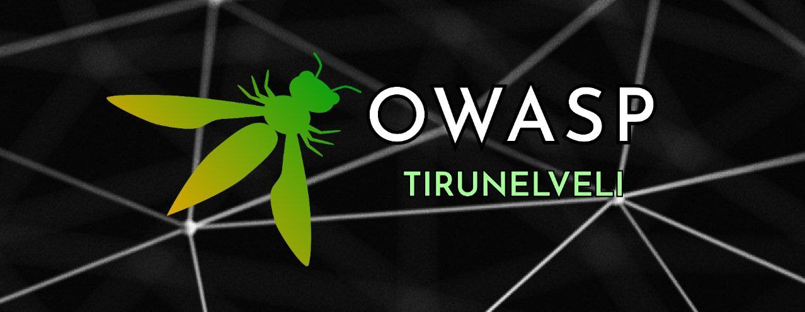

## Welcome

Welcome to the OWASP Tirunelveli chapter homepage.

The Open Web Application Security Project (OWASP) is a worldwide nonprofit organization that is dedicated to improving the security of software. The main objective of OWASP is to provide insights and tools to help improve application security globally. Every three years, OWASP publishes list of top-ten security flaws obtained from industry data and independent research. These lists contain the most commonly seen, and most commonly exploited vulnerabilities.

OWASP Tirunelveli was founded in Jan 2022. We organise Meetups, Webinars and Conferences. All these events are open for everyone. We do webinars on topics related to Computer Science and share knowledge mainly on Cyber Security. Join our mission to make Cyber Space a Better Place!

## Participation

Call For Speakers is open - if you would like to present a talk on any topic related to Computer Science or any trending security topics at future, feel free to reach out our chapter Leaders

Leaders contact :

 [Karuppasamy Karruppiah](mailto:karuppasamy.karuppiah@owasp.org) 
 
 
 [Aravindhakumar Manimaran](mailto:aravindhakumar.manimaran@owasp.org)

Chapters are led by local leaders in accordance with the [Chapters Policy](/www-policy/operational/chapters). Financial contributions should only be made online using the authorized online donation button.

Everyone is welcome and encouraged to participate in our [Projects](/projects/), [Local Chapters](/chapters/), [Events](/events/), [Online Groups](https://groups.google.com/a/owasp.com/){:target='\_blank'}, and [Community Slack Channel](https://owasp.slack.com/){:target='\_blank'}. We especially encourage diversity in all our initiatives. OWASP is a fantastic place to learn about application security, to network, and even to build your reputation as an expert. We also encourage you to be [become a member](/membership/) or consider a [donation](/donate/) to support our ongoing work.

**Email Format :**

- Speaker name
- Job Role
- Company / Organization
- Country
- Email ID
- Contact Number
- Speaker Profile
- Presentation Details
    - Name / Title of the Presentation
    - Abstract of the presentation
    - Presentation time required
 

## Next Meeting/Event 



